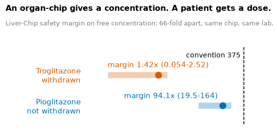
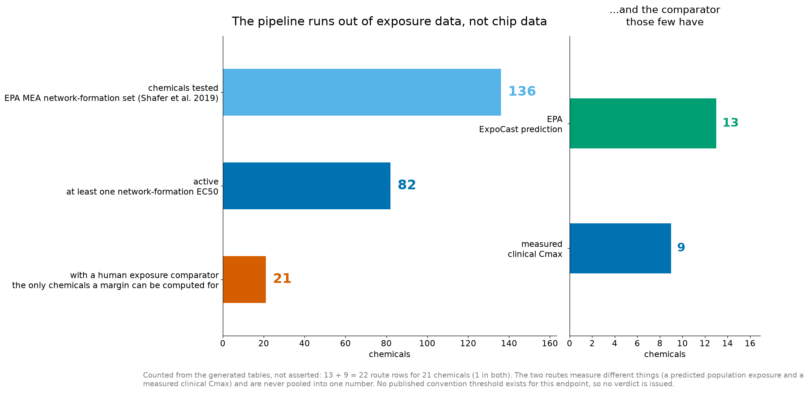
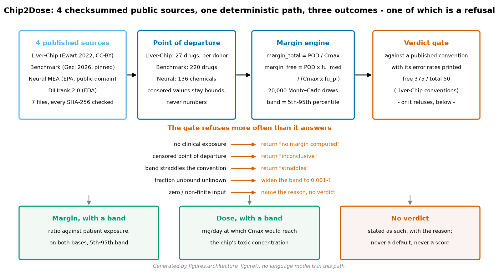
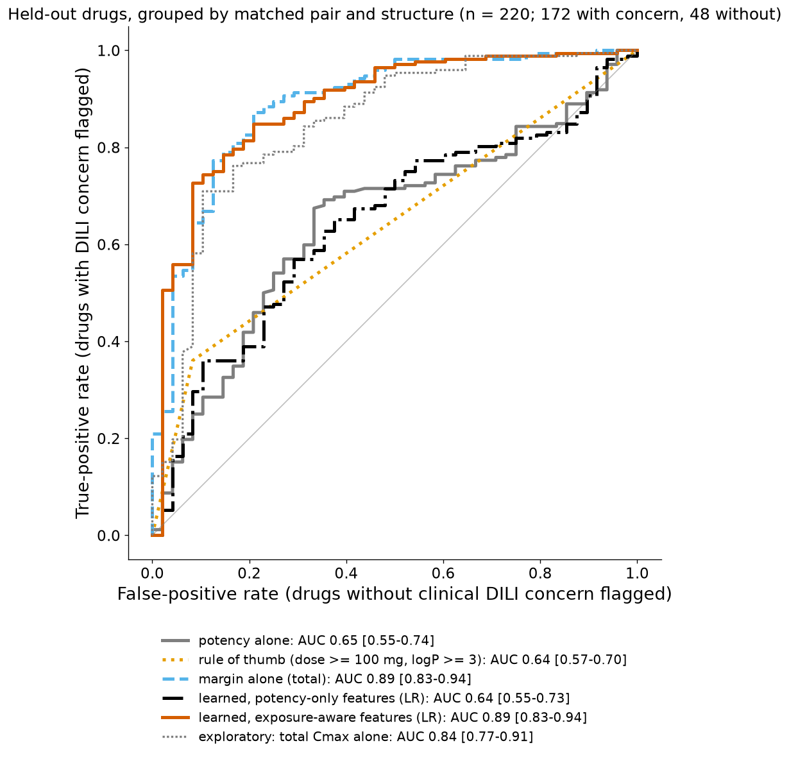
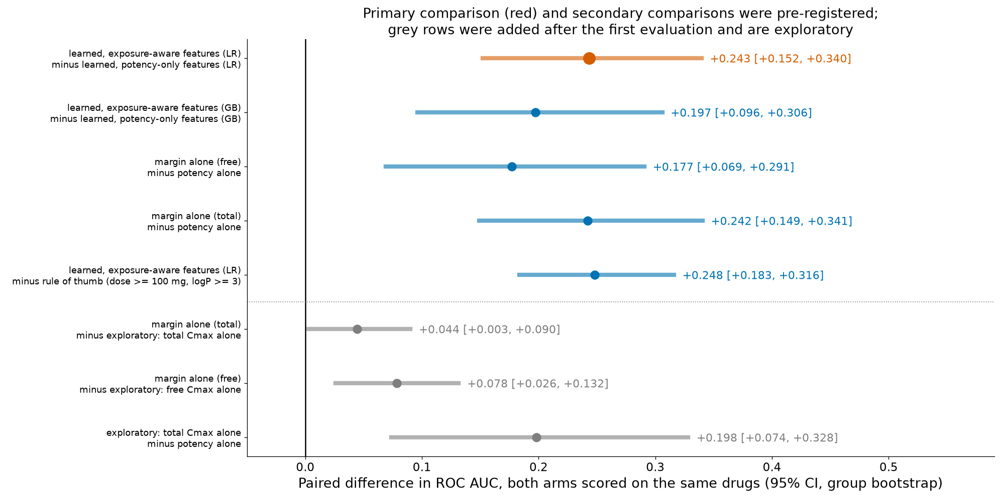

# Chip2Dose: milligrams, not scores

### Turning an organ-chip concentration into a human dose margin with an uncertainty band, and counting where the field runs out of data

**Technical report.** Every number in this report is produced by the code in this repository from the public inputs listed in Section 3, and is reproduced by `make` from a clean clone. No language model appears anywhere in the numeric path (Section 11).

> ### What is new here
>
> Four things, in the order they matter.
>
> **1. A refusal architecture.** The tool declines rather than guesses, and the declining is the engineering. A point of departure at which no toxicity was seen stays a bound and never becomes a number; a missing clinical exposure returns "no margin computed" with no default substituted; an unknown fraction unbound widens the band across 0.001–1 instead of assuming a value; a band that straddles the convention is reported as straddling. On the 27-drug Liver-Chip set this costs **9 of 27 drugs their verdict**, reported as the headline of the section rather than hidden under the 14 that do resolve. The refusal is enforced in the test suite, not just intended: a column named like a probability cannot reach `results/` without a test failing. *(Sections 4.5, 5.3, 7.1)*
>
> **2. Dose is the output type, not a better score.** Section 1 states what the field reports: a classifier answer to *is this compound toxic?* This work answers a different question in a different unit — milligrams per day with a band, or a margin against the patient's real exposure with a band. **A score cannot be taken into a dose discussion and a dose can**, which makes this a different product category rather than a better model of the same category. Classifier probabilities exist only inside the validation figures and never become a per-compound number. *(Sections 1, 4.4, 5.3)*
>
> **3. The field runs out of exposure data an order of magnitude before it runs out of chip data — counted, not argued.** Of 136 chemicals a neural chip has measured, **115 have no public human exposure value of any kind**. The bottleneck everyone assumes is the chip is not the chip, and this is the first place that claim is put as a number: the funnel is produced by the pipeline and shipped as a table and a figure. *(Sections 7.4, 8.3)*
>
> **4. The evaluation was committed before it was run, and it would have published a null.** The analysis plan and the fold assignment were fixed in advance; the folds are grouped so that matched pairs, the same molecule and structural neighbours never sit on both sides of a split; every arm carries a group-bootstrap interval; arms are compared as a paired difference on identical folds. **All three possible outcomes were written down in advance, including the two that would have been bad news** — which is what makes the one that fired worth reading. *(Section 6)*

---

## 1. Problem: a chip gives a concentration, a patient gets a dose



*Figure 1. The output, on one matched pair. Troglitazone (withdrawn) and pioglitazone (still prescribed) are structural twins measured on the same chips in the same study. Their safety margins on the free basis sit 66-fold apart and their bands do not overlap; both fall below the published convention of 375, so the convention flags both and the distance from it is what separates them. Generated by `figures.card_image()` into `results/card.png`; the numbers behind it are in `results/pair_table.csv`.*

An organ-on-a-chip experiment ends with a concentration. The chip was perfused at 1 µM, or 10 µM, and somewhere on that scale the tissue showed injury. A prescription, on the other hand, is a dose: 45 mg a day, or 600. Between the two sits a conversion that almost nobody publishes — and the safety scientist who has to defend a decision in a program meeting does it by hand, in a spreadsheet, or does not do it at all.

Most computational work on organ-chip and high-content data answers a different question. It asks *is this compound toxic?*, and it answers with a classifier score. That is a useful question, and it is not the question a safety scientist asks. They ask: **at what human dose does this become a concern, and how sure are we?** A score between zero and one cannot be taken into a dose discussion. A margin against the patient's actual exposure can, and so can a daily dose in milligrams with a band around it.

**Chip2Dose is that step.** It takes a point of departure from a chip — the lowest concentration at which the chip shows toxicity — converts it to a comparison against the drug's real clinical exposure on both the total and the protein-unbound basis, propagates every input range into an uncertainty band rather than a point, and where a dose-matched clinical Cmax exists, expresses the result as the daily dose at which a patient's exposure would reach the chip's toxic concentration. The output is a ratio with a band, or a dose in mg/day with a band. **There is no 0–1 toxicity score anywhere in the product, the figures or the tables** — classifier probabilities exist only inside the validation ROC of Section 7.2 and never leave it.

### 1.1 What this report establishes, and what it does not

The conversion works and it is reproducible. Section 7.1 reports margins with bands for all 27 drugs of the Ewart et al. Liver-Chip study (Ewart et al. 2022), including the equivalent daily dose where the source supplies a dose-matched Cmax. One command regenerates every number and every figure from a clean clone.

On published clinical outcomes, exposure-aware features separate those outcomes better than potency alone. The benchmark is 220 drugs with a clinical Cmax, a DILIrank outcome, and a point of departure that is **the lowest value across 23 published laboratory assay labels — a transporter-inhibition assay most often, and not one of the 23 is an organ-chip measurement** (Section 2.2 enumerates them, and that composition is stated here because it bounds everything that follows). On that set, a logistic regression on exposure-aware features reaches AUC 0.887 [0.826, 0.937] against 0.643 [0.552, 0.733] for the same model on potency-only features — a paired difference of **+0.243 [+0.152, +0.340]** on identical folds. The analysis plan and the fold assignment were committed before the first evaluation was run. **This direction is not our discovery**: Geci et al. (2026) report it, and Section 2 says so before any of our numbers appear. What is new is the pre-registration, the structure-grouped interval, the paired comparison, and the dose layer on top.

**The finding a reader should take away even if they take nothing else is that the field's bottleneck is not the chip.** Applying the identical pipeline to a second organ, the EPA's microelectrode-array dataset of network formation in cortical neurons (Shafer et al. 2019), the chip has measured **136 chemicals**, of which **82 are active**, and of those **21 have any public human exposure value to set the concentration against** — 13 through an EPA population-exposure prediction, 9 through a measured clinical Cmax, simvastatin through both. For 61 of the 82 active chemicals, and for **115 of all 136 the chip has already measured**, no margin can be computed at all. Not because the chip data are missing. Because the published exposure half is. That count is generated by the pipeline, not asserted: `results/neural_coverage.csv` and `results/neural_coverage.png`.



*Figure 2. Where the pipeline stops, and it is not at the chip. Of 136 chemicals the microelectrode-array dataset has measured, 82 are active and 21 have any public human exposure value to set a concentration against. The right panel splits those 21 by route: 13 EPA predictions, 9 measured clinical Cmax values, simvastatin in both. Generated by `figures.neural_coverage_figure()` into `results/neural_coverage.png` from `results/neural_coverage.csv`.*

**What this report does not establish** is that the same advantage holds for a chip-derived point of departure. The 220-drug benchmark is built on published laboratory assays — Section 2.2 enumerates them, and none of the 23 assay labels is an organ-chip measurement. No public dataset pairs organ-chip measurements for 220 drugs with clinical liver outcomes; that absence is the same one the neural count measures. **The benchmark is where the thesis is tested; the chip is where the method is applied.** The step between the two is an assumption this report states rather than a result it presents, and Sections 2.2 and 8 both say so.

### 1.2 Who it is for

A safety scientist at a chip laboratory or a pharmaceutical toxicology group who must answer "at what human dose does this become a concern, and how sure are we?" and defend the answer to a program team or a regulator. Every output carries its band, every threshold is labelled a convention and printed with its published error rates, and the tool refuses to produce a verdict where its inputs do not support one.

---

## 2. Prior work and what is new here

The benchmark of 220 drugs used throughout this report is derived from the integrated dataset published by Geci et al. (2026, *Arch Toxicol* 100(5):2029–2046, doi:10.1007/s00204-026-04305-2). That paper, not this work, is the source of the central observation that in-vitro potency carries little information about clinical liver injury until it is set against human exposure. The authors report that "all collected in vitro toxicity values of drugs showed little ability for distinguishing DILI concern classes on their own", and that "the ratio of in vivo Cmax to lowest functional in vitro toxicity of each compound" separates clinical DILI classes with ROC AUC up to 96 %. Both statements come from a retrospective analysis of the full set of 241 drugs, reported as point estimates without confidence intervals, without a pre-specified analysis set, and without structure-based grouping of the drugs. This is not a criticism of that work: a retrospective analysis is the right way to establish that a relationship exists, and it is what the paper set out to do. (The abstract additionally reports a predicted-Cmax PBK arm reaching "up to 91 % prospectively", which is a separate claim from the ratio compared here.)

What this work adds on that benchmark is a pre-registered evaluation of the same relationship, out-of-fold estimation for the arms that are actually fitted, and the dose layer that sits on top of both. The comparison is pre-registered: the analysis plan and the fold assignment were committed to `validation/preregistration.json` and `validation/split.csv` before the first evaluation was run, and the code refuses to evaluate if either has since changed (`validation/code_freeze.json` additionally fingerprints the 36 functions and constants that execute the plan). The folds are grouped, so that matched toxic/non-toxic pairs, the same molecule at different doses, and structurally similar drugs (Morgan radius 2, 2048-bit, Tanimoto ≥ 0.4) never sit on both sides of a split; on the primary endpoint the 220 drugs collapse into 177 such groups. Every arm is reported with a confidence interval, and the comparison between arms is a paired difference on identical folds rather than a contrast of separately estimated AUCs. Beyond the benchmark, the margin is expressed as an equivalent daily dose in mg rather than a ratio, and the identical pipeline is applied to a second organ (neural network formation on microelectrode arrays).

### 2.1 The published ratio on a pre-registered set, with an interval

The paper reports two AUC figures for its ratio, one per class definition. Those two definitions are reproduced here class for class, which makes each figure directly comparable with one of our endpoints:

| Class definition (the paper's wording) | Geci et al., retrospective, 241 drugs | This work, pre-registered set, grouped CI |
|---|---|---|
| "No- from Most-DILI and Clinical Development Failure drugs" | 96 % (point estimate, no CI) | **0.938 [0.884, 0.980]** (n = 152, 132 groups) |
| "No- from Less-, Most-DILI and Clinical Development Failures" | 90 % (point estimate, no CI) | **0.889 [0.829, 0.940]** (n = 220, 177 groups) |

The section states plainly what kind of agreement this is, because the estimator on both sides is the same: the paper's ratio has no fitted parameters, and neither does the `margin alone` arm reported here (`src/validate.py`, `kind="score"`). The ratio is not re-estimated on held-out drugs, because there is nothing in it to estimate, and the pre-registered split therefore cannot move the point estimate — it fixes which drugs are in the set and it defines the groups the bootstrap resamples. That identity of estimator is what makes the two columns comparable at all, and it is the reason the agreement is worth reporting: a fixed ratio carried from the paper's 241 drugs to a set and a plan committed in advance, now with an interval around it and with a paired comparison against potency alone that the retrospective analysis does not report. Held-out estimation in this work belongs to the learned arms of Section 7.2, where the pre-registered primary comparison (+0.243 [+0.152, +0.340]) sits between two fitted models.

Both of our confidence intervals contain the published point estimate. The two comparisons are not like for like, and the report states the three reasons in this same paragraph: our analysis covers 220 of the 241 drugs (oral only, one row per molecule, non-ambiguous label); the published values carry no interval, so "contains their point estimate" is a one-sided statement about our uncertainty and not about theirs; and the two ratios are not built from the same assays, because the paper's ratio uses functional toxicity only ("Functional toxicity refers to all in vitro toxicity data except BSEP inhibition") while the lowest point of departure used here is the minimum over all available assays, BSEP inhibition included. A BSEP-excluded variant of the margin is named in Section 9 as future work; it is not reported here, because adding an arm after the first evaluation would break the pre-registration this comparison rests on.

One further reading of the same table is worth stating, because a reviewer who has read only the abstract will arrive with the figure 96 % in mind: setting that 96 % against our 0.889 would suggest that a grouped, pre-registered evaluation cost about 0.07. It is an artefact of comparing two different class definitions. The matched comparisons are the two rows above.

What does not survive as a novelty claim is the direction of the finding itself, and the report says so where the result is first presented (Section 7.2): the ordering of the arms, and the size of the paired advantage over potency alone (+0.243 [+0.152, +0.340] on the primary endpoint), are a confirmation of Geci et al.'s observation rather than a discovery.

### 2.2 What the benchmark's point of departure is made of

Every AUC in this report is computed on Geci et al.'s `lowestPOD` column, so the report states what that column contains before it states any result. It is the lowest in-vitro value across the seventeen published hepatotoxicity datasets the authors integrated, and across the 220 drugs analysed here those values carry 23 distinct assay labels. Counted from the shipped `pod_sources` column rather than from the documentation: a BSEP inhibition IC50 is the lowest point of departure for 70 of the 220 drugs; THLE and HepG2 cytotoxicity in cell-line monolayers appear among the points of departure of 117 and 113 drugs; Cell Painting cytotoxicity of 79; and the remainder are per-publication lowest-POD aggregates together with ToxCast HepG2 high-content imaging, mitochondrial inhibition and uncoupling readouts, and a second transporter assay (MRP2). **None of the 23 labels is an organ-chip measurement, and the most frequent single label is a transporter-inhibition assay.**

Two counts are reported for each assay, because they answer different questions and have been confused before: *which assay produced the lowest POD*, and *which assays a drug was tested in at all*. Produced the lowest POD: BSEP for 70 drugs, Cell Painting cytotoxicity for 27, HepG2 cytotoxicity for 18, THLE cytotoxicity for 9; the remaining 96 drugs spread over 14 further labels, and 5 of the 23 labels never produce any drug's lowest POD. Merely present among a drug's points of departure: BSEP for 149, THLE for 117, HepG2 for 113, Cell Painting for 79.

This is a property of where clinical ground truth exists, not an oversight in the benchmark. A DILIrank outcome is available for a drug because that drug reached patients, and a drug that reached patients was characterised in the conventional assays available at the time; no public dataset pairs organ-chip measurements for 220 drugs with clinical liver outcomes. The consequence is stated here and again in Section 8: the benchmark is where the thesis is tested and the chip is where the method is applied (27 Liver-Chip drugs in Section 7.1, 136 neural chemicals in Section 7.4), so **the step from "exposure-aware features separate clinical outcomes better than potency-only features on published in-vitro PODs" to "the same holds for a chip-derived POD" is an assumption this report states, not a result it presents.** How far apart the two worlds sit is itself measured in Section 7.4: for 115 of the 136 chemicals the neural chip has measured, no public human exposure value exists to set a chip concentration against.

---

## 3. Data: three published sets, provenance and licenses

Seven input files, each recorded in `data/sources.json` and `data/provenance.csv` with its URL, license, access date and SHA-256. Every run re-verifies those checksums before it computes anything.

| Source | Files | License | Used for |
|---|---|---|---|
| Ewart L, et al. *Commun Med* **2**, 154 (2022) | Supplementary Data 1 and 8, plus the article full text | CC-BY 4.0 | The 27-drug Liver-Chip set, the matched pairs, the MOS-like values and the dosing rule (Section 7.1) |
| Geci R, Sayin AZ, Schaller S, Kuepfer L. *Arch Toxicol* **100**(5):2029–2046 (2026), doi:10.1007/s00204-026-04305-2 | Drug literature data; predicted compound properties | repository carries no license file — **not redistributed** | The 220-drug benchmark: lowest in-vitro POD, clinical Cmax, daily dose, logP (Sections 2.2, 7.2) |
| Shafer TJ, et al. *Toxicol Sci* **169**(2):436–455 (2019); data doi:10.23719/1503191 | MEA and ToxCast AED workbook | US Government work, public domain | The neural application: 136 chemicals, network-formation EC50s, administered equivalent doses (Section 7.4) |
| U.S. FDA, DILIrank 2.0 | `dilirank_2.0.xlsx` | US Government work, public domain (17 U.S.C. 105) | Clinical outcome labels for the benchmark endpoints |

**Redistribution.** Public-domain and CC-BY files are cached in `data/raw/` so that reproduction never depends on a live third party. The two Geci et al. spreadsheets are the exception: their repository carries no license file, so they are **not** redistributed here. `make data` fetches them from a pinned commit (`861f63d5`) and verifies the SHA-256 before use. This is the single network dependency in the whole pipeline, and it is stated again in Section 9.

### 3.1 Cross-checks: published numbers re-derived from their inputs

Before any result is presented, six published quantities are re-derived from the data they are built from. The point is not to find errors in the sources; it is to prove the pipeline reads the columns the way their authors meant them. Mismatches are reported, never silently dropped (`results/crosschecks.csv`).

| Check | Checked | Mismatches | Tolerance |
|---|---|---|---|
| Geci `lowestPOD` = min(POD values) | 254 | 0 | rel. 1e-6 |
| Geci Cmax = curated value, else median of sources | 254 | 0 | rel. 1e-6 |
| EPA MEA `min.ec50` = min over entries of the same chemical | 146 | 0 | rel. 1e-6 |
| Liver-Chip free dose = multiplier × Cmax × fu(plasma) | 224 | **8** | rel. 5 % |
| Liver-Chip "both donors" MOS = combination rule | 18 | 0 | rel. 1e-6 |
| Cmax agreement, Liver-Chip SD1 vs Geci et al. | 21 | **3** | within 3-fold |

The two non-zero rows are informative rather than alarming. The eight dosing rows that do not reproduce within 5 % are telithromycin's low-dose rows, and the source itself footnotes a dosing calculation error for troglitazone. The three Cmax disagreements are between two independent literature compilations of the same quantity — the hero pair's troglitazone is one of them, at 6.08 µM in the chip study against 6.79 µM at 600 mg in the benchmark — and the report names both values and their sources wherever they both appear rather than reconciling them silently (Section 7.1).

---

## 4. Method: concentration to dose



*Figure 3. The system, end to end. Four published sources (7 files, every one checksummed on every run) → point-of-departure extraction → the Monte-Carlo margin engine → a verdict gate against a published convention. The five branches below the gate are the cases in which the tool declines to answer, and the third output is one of them. **Every count in the figure is derived at run time** — the file count and the four dataset sizes from the tables the run has just produced, the source count from the distinct DOIs in `data/provenance.csv` — so the diagram cannot drift away from the pipeline. Generated by `figures.architecture_figure()` into `results/architecture.png`.*

Four steps, all deterministic, implemented in `src/pod.py`, `src/margin.py` and `src/config.py`.

### 4.1 Point of departure

The point of departure is the lowest concentration at which the assay shows the effect of interest, taken per donor or per replicate where the source provides them.

- **Liver-Chip**: the minimum toxic concentration, reconstructed as the published MOS-like value × total Cmax (Ewart et al. 2022, Table 4 and Supplementary Data 1), separately for each of the two donors.
- **Literature benchmark**: Geci et al.'s lowest in-vitro POD across 17 integrated hepatotoxicity datasets — the quantity Section 2.2 enumerates.
- **Neural**: the lowest EC50 across the 17 network-formation parameters of the EPA MEA assay (Shafer et al. 2019).

A point of departure at which no toxicity was observed up to the highest tested concentration is a **censored lower bound**. It is carried through every downstream calculation as a bound and is never treated as a number — Section 7.1 shows what that costs on the matched pairs.

### 4.2 Margin, on both bases

Two ratios are computed and reported separately, never pooled:

```
margin_total = POD / Cmax_total
margin_free  = POD × fu_medium / (Cmax_total × fu_plasma)
```

**The free margin is the reference comparison**, because unbound drug is what reaches the target, and because the Liver-Chip was dosed so that the free medium concentration is a multiple of free plasma Cmax. That dosing rule is not assumed: it was re-derived against Supplementary Data 1 and reproduces for 216 of 224 dosing rows within 5 % (Section 3.1).

Reporting both bases is not redundancy. For the hero pair of Section 7.1 the two bases order the margins the same way — 66-fold apart on free, 93-fold on total — but they put the *prescribed dose* on opposite sides of its band. Any surface in this repository that prints a converted number names the basis it is on, for that reason.

### 4.3 Uncertainty

Every input is a range, not a point: two donors, several published Cmax values, a fraction unbound from the study plus three predictors. Where a source supplies a single value, a **3-fold range is assumed** and the assumption is counted in `n_assumptions` and printed with the result. Where the fraction unbound is unknown, the band is widened across 0.001–1 and labelled, rather than a value being invented.

Bands are the 5th–95th percentile of **20,000 Monte-Carlo draws** propagating every input range. No output in this repository is a point estimate without a band.

### 4.4 Equivalent daily dose

Where the clinical dose and the Cmax measured at that dose come from the same source, the margin becomes the daily dose at which a patient's Cmax would reach the chip's toxic concentration:

```
equivalent_dose_mg = clinical_dose_mg × margin_total
```

**The conversion is on total concentration by construction**, because the clinical dose is multiplied by the total-basis margin — so every dose this repository prints carries that basis on its face. The step assumes **linear pharmacokinetics** (Cmax proportional to dose), which is stated next to every dose and is listed in Section 9 as a standing limitation.

### 4.5 Verdict, against a convention and not a limit

A verdict is issued only against a published **convention**, and the convention's error rates are printed beside it every time: free margin 375 (Liver-Chip, two donors: sensitivity 87 % [62–96 %], specificity 100 % on 27 drugs) or total margin 50 (sensitivity 80 % [54–93 %], specificity 100 %). These are small-sample estimates from a single 27-drug study and the report never calls them limits.

The tool declines to answer more often than it answers:

- a band that straddles the threshold is reported as straddling, not rounded to a side;
- a censored POD gives an inconclusive verdict, not a number;
- a missing clinical exposure gives "no margin computed" — no default is substituted;
- zero, negative or non-finite inputs, and a fraction unbound outside 0–1, each give a named reason and no verdict;
- a compound absent from DILIrank is reported as absent, not as negative.

---

## 5. Method: the learned model, and why it is the AI method here

### 5.1 Why a small auditable classifier and not an image model

The question this work asks is *whether adding exposure information to potency information changes how well clinical outcomes are separated*. That is a question about features, and answering it needs a model whose contribution per feature can be read off and checked — not one whose capacity could absorb the difference. A convolutional network on cell images would be the wrong instrument twice over: it would not answer the question, and it would make the answer unauditable.

So the AI method here is deliberately modest and completely inspectable: **L2-regularised logistic regression** (C = 1.0, median imputation with missing indicators, standardised features, no hyperparameter tuning) and, as a non-linear check, **histogram gradient boosting** (150 iterations, learning rate 0.05, 8 leaves, minimum 10 samples per leaf, no tuning). Both are run on two feature sets that differ by exactly the exposure block:

| Feature set | Features |
|---|---|
| Potency-only | `log_pod`, `log_nonbsep_pod`, `log_cytotox`, `log_bsep_ic50` |
| Exposure-aware | the four above **plus** `log_cmax`, `log_dose`, `logp`, `log_fu`, `log_margin_total`, `log_margin_free` |

**What "potency" means in every arm of this report** is the published in-vitro POD of Section 2.2 — the minimum over 23 laboratory assay labels, none of them an organ chip. It is not chip potency. Every statement about "potency alone" in this report inherits that definition.

### 5.2 What the model learned

The fitted coefficients are published (`results/model_coefficients.csv`), standardised so they can be compared:

| Feature | Standardised coefficient |
|---|---|
| `log_fu` | -1.027 |
| `log_cmax` | +0.682 |
| `log_margin_total` | -0.599 |
| `log_dose` | +0.577 |
| `missing:log_nonbsep_pod` | -0.529 |
| `logp` | -0.401 |
| `log_pod` | +0.095 |
| `log_bsep_ic50` | -0.050 |

The six largest contributions are the exposure block and an indicator for a missing potency value. The two raw potency terms sit near zero. The model, in other words, agrees with the headline it is being used to test — and it says so in coefficients a reviewer can read, rather than in an accuracy number they have to trust.

### 5.3 Is the AI method sound? The honest answer, stated here rather than buried

> **On the primary endpoint the interpretable ratio and the learned exposure-aware model land at 0.889 [0.829, 0.940] and 0.887 [0.826, 0.937] — intervals overlapping. On the stricter endpoint the learned model is ahead on the point estimate, 0.952 [0.897, 0.989] against 0.938 [0.884, 0.980], and those intervals overlap too. No paired difference between those two arms was pre-registered or computed. We ship the ratio because it returns a dose with a band instead of a score, not because it won.**

That paragraph is the answer to "is the AI method sound", and it is placed here rather than in the limitations because it is a result, not an apology. The learned arms earn their place in this report by answering the pre-registered question — does adding exposure to potency change the separation? — and the answer is +0.243 [+0.152, +0.340] (Section 7.2). They do not earn a claim of superiority over the parameter-free ratio, because no such comparison was pre-registered, a post-hoc one would be labelled as such, and two overlapping intervals support "not beaten", never "beats".

**The reporting rule is absolute and it is enforced in code**: classifier probabilities appear only inside the validation figures of Section 7.2 and 7.3. They never become a per-compound score in any table, figure or CLI output, and a test fails if a per-compound probability-shaped column appears in `results/`.

---

## 6. Experiments: the pre-registered plan and the split

`validation/preregistration.json` and `validation/split.csv` were committed at **commit `a76e7e9`, before the first evaluation was run**; the evaluation results first appear in later commits. The plan, verbatim from that file:

- **Question.** "Does an exposure-aware model separate clinical DILI outcomes better than potency alone?"
- **Data.** Geci et al. 2026 integrated table at a pinned commit, oral drugs only.
- **Inclusion.** A lowest in-vitro POD, a total Cmax and a DILI label must all be present; "Ambiguous" labels excluded; one row per molecule (the first row in the authors' file order where a molecule appears at several doses). → **n = 220**.
- **Primary endpoint.** DILIrank binary convention: vMost + vLess + clinical-development DILI failures = 1, vNo = 0. **172 with concern, 48 without.**
- **Secondary endpoint.** Narrow: vMost + clinical-development failures = 1, vNo = 0, vLess excluded. **n = 152.**
- **Arms.** Eight, listed in Section 7.2.
- **Primary comparison.** `learned, exposure-aware features (LR)` minus `learned, potency-only features (LR)`.
- **Secondary comparisons.** Four, listed in Section 7.2.
- **Statistic.** Paired difference in ROC AUC on identical folds; 95 % CI from a group-level bootstrap (2,000 draws) of the repeat-averaged out-of-fold scores.
- **Grouping.** Connected components of: matched pairs (Ewart et al. Table 1), same molecule, and Morgan r = 2, 2048-bit Tanimoto ≥ 0.4. **177 groups on the primary endpoint, largest group 5.**
- **Cross-validation.** 20 repeats of 5-fold grouped CV, seed 20260929.
- **Split hash.** `7fa9792d2b8cb3940ea9280d87b26f9d51663deec99aa2967d45f234d5b16d2e`.
- **Reporting rule.** "Classifier probabilities appear only inside validation figures; never as per-compound scores."

### 6.1 The three outcomes fixed in advance

The plan committed to how each possible result would be reported, before any of them was known:

1. Paired difference positive, CI excludes zero → the claim stands.
2. Paired difference positive, CI includes zero → directional only, reported as not significant.
3. Paired difference ≤ 0 → reported as a negative result.

**Case 1 fired.** The report would have carried case 2 or case 3 in the same place with the same prominence; that commitment is what makes case 1 worth anything.

The full scope of the integrity check — including what it does **not** cover — is documented in the repository's `README.md` for anyone auditing it.

---

## 7. Results

### 7.1 The Liver-Chip: 27 drugs, and what one pair looks like as a dose

The pipeline produces a margin with a band for all 27 drugs of the Ewart et al. Liver-Chip study, on both bases, with the equivalent daily dose wherever the source supplies a dose-matched Cmax (`results/liver_margin_table.csv`, `results/liver_margins.png`). Against the published free-margin convention of 375, the verdicts are **14 below, 4 straddling the threshold, and 9 inconclusive because the comparator's point of departure is censored**. Nine of 27 declining to answer is the honest arithmetic of a 27-drug study with censored non-toxic partners, and it is reported as the headline of this section rather than hidden under the 14.

**The matched pair.** Troglitazone and pioglitazone are structural twins from the same study, same chips, same analysis. One was withdrawn from the market; one is still prescribed. On the free basis:

| | Chip POD | Clinical Cmax | Margin (free) | Band (5–95 %) | Verdict vs 375 | Clinical fate |
|---|---|---|---|---|---|---|
| Troglitazone | 0.182 µM | 6.08 µM | **1.42×** | 0.054–2.52 | below | withdrawn (Garside rank 1) |
| Pioglitazone | 8.4 µM | 3.0 µM | **94.1×** | 19.5–164 | below | still prescribed (Garside rank 3) |

**66-fold apart, and the bands do not overlap** (2.52 < 19.5). Both fall below the published convention, so the convention flags both; what separates them is the distance from it, and the margin orders the pair the way the clinic did.

Three things must be said in the same breath, and the report says them here rather than in a footnote:

1. **This is not "identical potency, opposite verdicts".** Their chip potencies already differ 46-fold (0.182 µM against 8.4 µM), so **potency alone already ranks this pair correctly**. The pair demonstrates what the output *is*; it is not evidence that the method beats potency. That evidence is the benchmark in Section 7.2.
2. **No matched pair in this set has near-identical potency.** The non-toxic partners are mostly censored — no toxicity up to the highest tested concentration — so six of the seven pairs cannot be compared on potency at all. That is a limitation of pair-based chip validation in general, not of these drugs.
3. **Two published Cmax values exist for troglitazone** and both appear in this repository: 6.08 µM in the chip study, 6.79 µM at 600 mg in the benchmark. They are two measurements of one quantity from two literature compilations; neither is adjusted to the other, and each block names its own source.

**As a dose** (`results/dose_view.png`, on total concentration by construction): the chip's toxic concentration is reached at about **16 mg/day** for troglitazone against **600 mg prescribed** — above the whole band — and at about **90 mg/day** for pioglitazone against **45 mg prescribed**, below the point estimate but inside the band. On the free basis each of those prescribed doses moves to the other side of its band, which is precisely why the pair's headline comparison in this report is the margin and not the dose.

**Where the margin stops being able to confirm an ordering.** Trovafloxacin and levofloxacin: chip potency orders them correctly (95 µM against no toxicity up to 532 µM). Once exposure enters, trovafloxacin's margin (74×) sits above levofloxacin's *lower bound* (> 45×), so the margin can no longer confirm the order. That is reported as **inconclusive, not as a demonstrated reversal**.

### 7.2 The benchmark: 220 drugs, pre-registered

All eight pre-registered arms on the primary endpoint (n = 220; 172 with concern, 48 without; 177 groups), with group-bootstrap intervals:

| Arm | AUC [95 % CI] | Fitted? |
|---|---|---|
| potency alone | 0.647 [0.549, 0.739] | no — fixed score |
| dose rule of thumb (≥ 100 mg/day, logP ≥ 3) | 0.639 [0.574, 0.700] | no — fixed rule |
| margin alone (total) | 0.889 [0.829, 0.940] | no — fixed ratio |
| margin alone (free) | 0.824 [0.750, 0.892] | no — fixed ratio |
| learned, potency-only features (LR) | 0.643 [0.552, 0.733] | yes, out-of-fold |
| **learned, exposure-aware features (LR)** | **0.887 [0.826, 0.937]** | yes, out-of-fold |
| learned, potency-only features (GB) | 0.649 [0.544, 0.749] | yes, out-of-fold |
| learned, exposure-aware features (GB) | 0.846 [0.772, 0.910] | yes, out-of-fold |

The pre-registered comparisons, each a paired difference on identical folds (`results/paired_difference.png`):

| Comparison | Primary endpoint | Stricter endpoint |
|---|---|---|
| **PRIMARY** — exposure-aware (LR) − potency-only (LR) | **+0.243 [+0.152, +0.340]** | +0.278 [+0.196, +0.375] |
| exposure-aware (GB) − potency-only (GB) | +0.197 [+0.096, +0.306] | +0.253 [+0.151, +0.370] |
| margin alone (total) − potency alone | +0.242 [+0.149, +0.341] | +0.274 [+0.183, +0.376] |
| margin alone (free) − potency alone | +0.177 [+0.069, +0.291] | +0.217 [+0.114, +0.329] |
| exposure-aware (LR) − dose rule of thumb | +0.248 [+0.183, +0.316] | +0.277 [+0.205, +0.353] |



*Figure 4. The pre-registered evaluation set, grouped by matched pair and structure (n = 220; 172 with concern, 48 without). Six curves: the two parameter-free score arms, the dose rule of thumb, the two learned arms, and the exploratory exposure-alone curve of Section 7.3. Every entry carries its AUC and interval. Generated by `figures.roc_figure()` into `results/roc.png`.*



*Figure 5. Paired differences in AUC, both arms scored on the same drugs in the same bootstrap draw. The primary comparison is the top row; the grey rows below the first divider were added after the first evaluation and are exploratory; the open square below the second divider is the post-hoc range-matched check of Section 8.1, on n = 195 rather than 220. Generated by `figures.paired_difference_figure()` into `results/paired_difference.png`.*

**Outcome case 1 fired**: the primary difference is positive and its interval excludes zero. Every drug in the learned arms was scored by a model that never trained on it, and no matched pair or structural neighbour sat on both sides of a split.

**What this confirms rather than discovers.** The direction and the rough size of this advantage are Geci et al.'s published observation (Section 2). What is new on these rows is that the set, the plan and the folds were fixed in advance, that the interval comes from a bootstrap resampling whole structural groups, and that the comparison is paired on identical drugs. The published ratio's own two figures and their matched counterparts here are in the table of Section 2.1; both of our intervals contain their point estimate.

**The two bases are reported separately and they disagree in magnitude.** `margin alone (total)` reaches 0.889 while `margin alone (free)` reaches 0.824 — the free basis is the one a toxicologist will ask for and it is the *weaker* arm on this benchmark. The report does not quietly promote whichever is higher: both are in the table, and Section 8 states what follows.

**One case the model gets wrong, in real units** (`results/failure_cases.csv`). Mifepristone has no clinical DILI concern and the exposure-aware model flags it, at a daily dose of 800 mg. Seven further cases are listed in the same file: metyrapone, etidronate and primidone flagged without clinical concern; phenelzine, estradiol, finasteride and tacrolimus not flagged despite a less-DILI-concern label. The cut used to call them was chosen in-sample, so the table is an illustration of failure modes and **not** a performance estimate. The file reports point estimates only; the band columns are listed in Section 9 as a known gap.

### 7.3 Exploratory: how much of this is exposure alone?

Added **after** the pre-registered results were read, labelled exploratory everywhere it appears, and reported because omitting it would overstate the contribution of the chip layer (`results/exploratory_wide.csv`, `results/exploratory_narrow.csv`):

| Exploratory arm | Primary endpoint | Stricter endpoint |
|---|---|---|
| total Cmax alone (no in-vitro potency at all) | 0.845 [0.774, 0.908] | 0.903 [0.833, 0.958] |
| daily dose alone | 0.818 [0.742, 0.887] | 0.879 [0.799, 0.942] |
| free Cmax alone | 0.745 [0.661, 0.823] | 0.813 [0.733, 0.889] |
| *post-hoc:* number of assays alone | 0.655 [0.566, 0.741] | 0.723 [0.634, 0.806] |

**Exposure alone, with no in-vitro potency whatsoever, already reaches 0.845.** Each concentration basis is its own baseline and the margin's increment over it is small: total Cmax 0.845 → margin (total) 0.889, an increment of **+0.044 [+0.003, +0.090]**; free Cmax 0.745 → margin (free) 0.824, **+0.078 [+0.026, +0.132]**. The larger increment is the one over the weaker baseline — the free margin arm at 0.824 sits *below* the 0.845 that total Cmax alone reaches, not above it — so the two increments cannot be added to a single baseline. On the stricter endpoint the total increment's interval **includes zero**: +0.035 [-0.006, +0.083].

That is the size of the effect on this benchmark, and this report does not claim it settles the question. Section 8 states what the benchmark structurally cannot measure.

### 7.4 The second organ, and the measurement that matters most

The identical pipeline — point of departure, both bases, Monte-Carlo band — runs on the EPA microelectrode-array dataset of network formation in cortical neurons (Shafer et al. 2019), using the dataset's own administered equivalent doses where they exist. No published convention threshold exists for this endpoint, so **no verdict is issued for any neural chemical**; margins are reported with bands and nothing else.

What the run measures is where the pipeline stops (`results/neural_coverage.csv`, `results/neural_coverage.png`):

| Stage | Count |
|---|---|
| Chemicals tested on the chip | **136** |
| Active (at least one network-formation EC50) | **82** |
| With any public human exposure comparator | **21** |
| — via EPA predicted population exposure | 13 |
| — via measured clinical Cmax | 9 |
| — in both routes | 1 (simvastatin) |

13 + 9 = 22 route rows for 21 chemicals. Margins are reported for those 21 only, in **two separate panels**, because the two routes measure different things and are never pooled.

**The finding is the funnel, not the margins.** For 61 of the 82 active chemicals — and for **115 of all 136 the chip has already measured** — the step from concentration to dose cannot be taken from any exposure source in these inputs. Not because the chip data are missing: the chip has done its work on all 136. Because the published exposure half does not exist. A method that converts chip readouts into doses runs out of *exposure* data an order of magnitude before it runs out of chip data, and 13 of the 21 comparators that do exist are EPA *predictions* rather than measurements.

This is also the honest boundary on the "one method, two organs" claim. Two organs is **evidence of transfer, not proof of it**: the conversion is organ-agnostic and takes an unseen readout one compound at a time, but the *verdict* is not — the thresholds are Liver-Chip conventions, and the tool says so itself on every readout it computes.

---

## 8. Why this benchmark cannot measure what a chip adds, and what measures it instead

Section 7.3 asks the question this section answers: if exposure alone already reaches 0.845, *then what is the chip buying?*

The answer is not a defence. It is a property of how this benchmark had to be built, and it is worth stating forward because it is also the argument for the whole method.

### 8.1 A drug is in this benchmark only because it already reached patients

Every drug on the 220-drug set has a DILIrank outcome. A drug has a DILIrank outcome because it was given to people and the clinical record was adjudicated. And a drug that was given to people **has a measured clinical Cmax by construction** — somebody measured it, in a trial, at a known dose.

So on this benchmark, "exposure alone" is available for **220 of 220 drugs, 100 %**.

Now consider the compound a chip laboratory actually has in front of it: a candidate at the bench, before first-in-human. There is no clinical Cmax, because there has been no clinical anything. Its measured human exposure is available for **0 %** of such compounds, by definition.

**The benchmark is therefore structurally incapable of containing a single compound in the position a chip laboratory is actually in.** Not under-represented — impossible. Any benchmark with clinical outcome labels has this property, which is why the comparison "margin versus exposure alone" cannot be the comparison that decides whether the chip layer is worth building.

### 8.2 A small increment over exposure alone is the correct and expected result here

Given 8.1, a margin built from a chip concentration *should* add little over a measured clinical Cmax on this set. The Cmax is a direct, in-vivo, human measurement of the quantity the margin is trying to bound. Where that measurement exists, an in-vitro proxy for the same quantity has very little room left to contribute, and +0.044 [+0.003, +0.090] is what "very little room, still positive" looks like.

This report therefore makes two separate claims and keeps them separate:

1. **Tested and supported here**: exposure-aware features separate clinical outcomes better than potency-only features, +0.243 [+0.152, +0.340] on identical folds, pre-registered (Section 7.2).
2. **Not tested here, and stated as an assumption**: that a chip-derived point of departure behaves like the published laboratory point of departure these arms are built on (Section 2.2).

What is *not* claimed anywhere in this report is that the margin beats a measured Cmax by a useful amount on drugs that already have one. On this benchmark it does not have room to, and the report does not ask the reader to pretend otherwise.

### 8.3 Where the chip laboratory's position *is* measured

The position 8.1 says this benchmark cannot contain is measured directly, elsewhere in this work, on the second organ.

Of the 136 chemicals the microelectrode-array dataset has measured, **115 have no public human exposure value of any kind** (Section 7.4, Figure 2). For those 115 the chip has produced a concentration and the exposure half simply does not exist — which is exactly the position of a candidate before first-in-human, and it is the majority case rather than the exception. Of the 21 that do have a comparator, 13 have a *predicted* population exposure rather than a measured one.

That funnel is the measurement this report offers for the question the benchmark cannot answer. It does not estimate how much a chip-derived margin would add where no Cmax exists — that would need a dataset pairing chip readouts with clinical outcomes, which does not exist publicly (Section 2.2). What it does establish, as a counted finding rather than an argument, is that **the setting the tool is built for is the common one, and the thing missing from it is the exposure half and not the chip.**

---

## 9. Failures, limitations and bias

### 9.1 Part of the headline is range, and we measured how much

Exploratory, post-hoc, run once on 2026-09-29 after the pre-registered results were read (`results/exploratory_range_matched.csv`).

Geci et al. warn that Cmax looks predictive in their integrated dataset partly because of a range artefact: in-vitro potency is compressed by test-concentration ranges while Cmax spreads wider. On our 220 drugs the lowest POD spans **5.22 orders of magnitude** and total Cmax **7.07** (5th–95th percentile: 2.44 against 4.45). Their "4 against 7" describes their dataset; ours has the same shape, less extreme.

Restricting to the 195 drugs whose Cmax lies inside the observed POD range, and refitting both primary arms inside that subset on the pre-registered folds, the primary difference falls from +0.243 [+0.152, +0.340] to **+0.162 [+0.058, +0.275]** (exposure-aware LR 0.839 [0.742, 0.917], potency-only LR 0.677 [0.562, 0.774]; 165 with concern, 30 without, 158 groups). **It shrinks by about a third and its interval still excludes zero.**

Which drugs the restriction removes decides how to read that. All 25 lie *below* the lowest POD, none above the highest: 18 without DILI concern and 7 with concern. On the full-set out-of-fold scores, at the in-sample Youden cut used for `failure_cases.csv`, the exposure-aware model calls all 18 correctly and misses 6 of the 7. **The restriction therefore mostly removes drugs the exposure-aware arm gets right, so it penalises that arm**: +0.162 is the conservative end of the estimate, not a corrected one.

Two limits on the check itself. The boundary is the *observed* POD range, which is derived rather than chosen but is still one of several defensible definitions. And a direct test of truncation was not possible: no POD in the benchmark source is written as a bound (`censored_pod_entries() == 0`), because Geci et al. kept only compounds with a reported potency value. That is a fact about how the benchmark was built, and it means drugs inactive at every tested concentration are absent by construction — so potency's weakness on this benchmark is partly a property of the benchmark and not only of potency.

### 9.2 What the chip adds over exposure alone

Measured in Section 7.3 and answered in **Section 8**, forward rather than as a limitation: a small increment over a measured clinical Cmax is the expected result on a benchmark every member of which, by construction, already has one.

### 9.3 Findings that work against us

- **Pioglitazone on the literature benchmark.** Its lowest POD is a potent BSEP IC50 (0.3 µM), so on the benchmark the margin ranks it *riskier* than troglitazone — the opposite of the clinic, and the opposite of what the chip data give.
- **The assay-count confound.** The lowest POD is a minimum over however many assays a drug was run in, so a drug tested more often has more chances at a low minimum. Measured as its own arm (exploratory, post-hoc), the assay count alone reaches **0.655 [0.566, 0.741]** on the primary endpoint and **0.723 [0.634, 0.806]** on the stricter one. Potency alone, scored on the same drugs in the same bootstrap draws, reaches 0.647 [0.549, 0.739] and 0.664 [0.563, 0.754]. **Those are two levels, not a comparison**: no paired difference between these two arms was pre-registered or computed, and on both endpoints each arm's interval contains the other arm's point estimate, so nothing here shows either arm separating the outcome better than the other. What it does show is that a count of how often a drug happened to be tested lands in the same range as its measured potency. This works against our headline and is reported rather than corrected: the exposure-aware arms reach 0.887 and 0.952 on the same two endpoints, so the confound does not account for the difference — but it does mean "potency alone" is not a clean measure of potency.
- **Grouping is a reduction, not an elimination.** Groups are formed at Morgan Tanimoto ≥ 0.4; 47 cross-group pairs sit between 0.3 and 0.4 (ciprofloxacin/levofloxacin at 0.39, for instance), so leakage at the level of a drug class is reduced and not excluded.
- **The free basis is the weaker arm.** The basis a toxicologist will ask for first — free, unbound — gives 0.824 against the total basis's 0.889 on this benchmark. Both are reported; neither is promoted for being higher.
- **`results/failure_cases.csv` carries point estimates only.** Every other output in this repository carries a band; that table does not, and the cut that produced it was chosen in-sample. Both facts are printed with the table.
- **Source issues found and reported, not corrected.** Telithromycin's low-dose rows in Supplementary Data 1 do not follow the stated dosing rule. Olanzapine's Cmax in Supplementary Data 1 (0.00009 µM) has no second source in our inputs. The chip study's own Tables 2/3 (multiples of unbound Cmax) and Table 4 (MOS-like values) disagree by up to about 2× for some drugs (asunaprevir, 190× against 126×). We use Table 4 throughout, and no verdict against 375 changes.

### 9.4 Standing limitations

- **No clinical or regulatory validity is claimed.** A margin supports a decision; it does not make one.
- **Linear pharmacokinetics** is assumed wherever a margin becomes an equivalent daily dose.
- **The thresholds are conventions from one 27-drug study**, and their error rates are small-sample estimates. They are Liver-Chip conventions, and for another organ the margin transfers while the verdict does not.
- **Reverse dosimetry is not re-run.** The neural administered equivalent doses are the EPA dataset's own, and **13 of the 21 neural comparators are EPA exposure *predictions*, not measurements.**
- **Practitioner-flagged gaps**, carried openly: the free-concentration basis is the referenced comparison but benchmark-concentration modelling (what the free concentration at the cell surface actually is, after binding to plastic and medium protein) is not implemented; there is no Python port of httk, so reverse dosimetry is out of scope for this version; and a BSEP-excluded margin variant — which would make our ratio like-for-like with the published one (Section 2.1) — is **future work, not an omission**, because adding an arm after the first evaluation would break the pre-registration the comparison rests on.
- **External validation on a second DILI dataset** has not been done. It is the first thing on the list in Section 11.

---

## 10. Reproduction

```bash
git clone https://github.com/millerandmuller/chip2dose && cd chip2dose
make            # creates .venv (Python 3.11), downloads + verifies data, writes results/
make test       # 102 tests
```

`make` regenerates **all 36 files in `results/`** — every figure and every table in this report. It takes about 2–3 minutes on an idle laptop CPU and up to roughly 10 minutes on a busy one; the pre-registered validation (20 × 5 grouped cross-validation, 2,000 bootstrap draws) is the slow step. **No GPU, no paid service, no API key.** If `python3.11` is not on the PATH: `make PYTHON=python3`.

**One network dependency, by license and not by design**: the two Geci et al. spreadsheets are not redistributed here (Section 3), so `make data` fetches them at a pinned commit and verifies their SHA-256. Everything else is cached in `data/raw/`. Every entry point re-verifies the input checksums before computing.

Single-compound and single-readout entry points, a few seconds each:

```bash
.venv/bin/python run_demo.py --compound troglitazone
.venv/bin/python run_demo.py --pair clozapine olanzapine
.venv/bin/python run_demo.py --readout 5 --cmax 2 --fu-plasma 0.02 --fu-medium 0.8 --dose-mg 200
```

The last of these is the whole method on a number the pipeline has never seen: a laboratory supplies its own chip concentration, its drug's clinical Cmax and the two fractions unbound, and gets back both margins with their bands, the equivalent daily dose on total concentration, the assumptions the tool made, and the reminder that the threshold convention is a Liver-Chip convention.

---

## 11. Disclosure, team, and future plans

### 11.1 AI-use disclosure

Code and prose in this repository were written with the help of an AI coding assistant. **No language model is in the numeric path.** Every number in this report comes from the deterministic pipeline of Sections 4–7 and the published inputs of Section 3; no model output, sampled text or inferred value appears in any result, figure or table. The classifiers of Section 5 are scikit-learn logistic regression and histogram gradient boosting — classical statistical models with published coefficients, not foundation models.

### 11.2 Team

- **Lutfiya Miller** — toxicology and the domain judgement: the dose-conversion logic, the basis conventions and their error rates, the practitioner constraints the tool is built against, and this report.
- **Chris Müller** — the pipeline: data ingestion and provenance, the margin engine, the pre-registered validation, reproducibility and the test suite.

The work is deliberately cross-disciplinary: the computational contribution is only meaningful because a toxicologist specified what "correct" means for a dose margin, and the toxicological claim is only defensible because the computation is pre-registered, grouped and reproducible.

### 11.3 Future plans

Stated explicitly, in the order we would build them.

**1. A batch path, and what it enables.** Today `--readout` takes one compound at a time, with its Cmax and its two fractions unbound supplied by hand. The next thing to build is the table-in, table-out version: a laboratory's own chip readouts on one side, its own exposure estimates on the other, and a **dose table with bands** out — every row carrying its basis, its assumptions and, where the inputs do not support one, no verdict at all.

That table is the layer a digital twin sits on. A simulation of an organ needs a quantity it can be anchored to, and "this concentration corresponds to this human dose, with this uncertainty" is that quantity in a unit a dose decision is already made in. The pipeline in this report produces exactly that quantity, one compound at a time, from public data; the batch path is what turns it into a layer rather than a lookup. This is a statement about what we plan to build, not a claim about any laboratory's data, and nothing in this report has been run on data we do not cite in Section 3.

**2. External validation on a second DILI dataset.** The single most valuable check of the claim in Section 7.2, and the honest gap named in Section 9.

**3. A raw concentration–response fitter**, so a laboratory can supply its own dose–response series rather than a single point of departure, and the fit's own uncertainty propagates into the band instead of the 3-fold assumption of Section 4.3.

**4. Reverse dosimetry via httk**, replacing the direct concentration-versus-Cmax comparison where a physiologically based model is warranted. There is currently no Python port, so this means either an R bridge or an implementation.

**5. The BSEP-excluded margin arm**, which would make our ratio like-for-like with the published one (Section 2.1) — as a new pre-registration, not as an addition to this one.

### 11.4 The invitation, and what it is bounded by

The measurement in Section 7.4 is also a proposal. The pipeline runs out of **exposure** data an order of magnitude before it runs out of **chip** data: 136 chemicals measured, 21 with any public human exposure value. A laboratory that holds both halves for its own compounds — the chip readout and the exposure estimate — can put them through the conversion demonstrated in Section 10 and get doses with bands back, whatever the organ.

What is bounded, and we would rather say it ourselves: the **conversion** is organ-agnostic and takes an unseen readout one compound at a time, which Section 10's third command does. The **verdict** is not — the thresholds are Liver-Chip conventions from a 27-drug study, and the tool prints that limit itself on every readout it computes. Nothing in this report claims a result about any specific laboratory's data, and the neural panels of Section 7.4 issue no verdicts for exactly that reason.

---

## References

- Ewart L, Apostolou A, Briggs SA, et al. Performance assessment and economic analysis of a human Liver-Chip for predictive toxicology. *Communications Medicine* **2**, 154 (2022). CC-BY 4.0.
- Geci R, Sayin AZ, Schaller S, Kuepfer L. Integration of in vitro and in silico approaches enables prediction of drug-induced liver injury. *Archives of Toxicology* **100**(5):2029–2046 (2026). doi:10.1007/s00204-026-04305-2.
- Shafer TJ, Brown JP, Lynch B, Davila-Montero S, Wallace K, Friedman KP. Evaluation of chemical effects on network formation in cortical neurons grown on microelectrode arrays. *Toxicological Sciences* **169**(2):436–455 (2019). Data: doi:10.23719/1503191 (US EPA, public domain).
- U.S. Food and Drug Administration. DILIrank 2.0 dataset. Public domain.

**License.** MIT for the code. Data files keep their own licenses, listed in `data/provenance.csv`.
